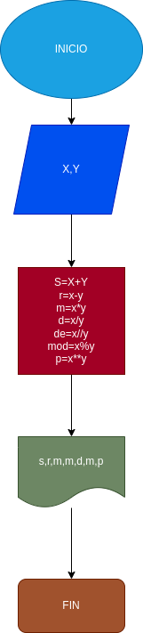

# Operaciones-aritmeticas-
programa para calcular las operaciones artmeticas 

# calcular mediante 2 numeros enteros distintas operaciones.

# Analisis 

-Variable de entrada 
X y Y:Es igual a dos numeros naturales,para desarrollar las operaciones aritmeticas correspondientes.

-Variable de salida 

s: x+y
r: x-y 
m: x*y
d: x/y
de: x//y
mod: x%y
p: x**y

# Diseño 

# Construccion 

